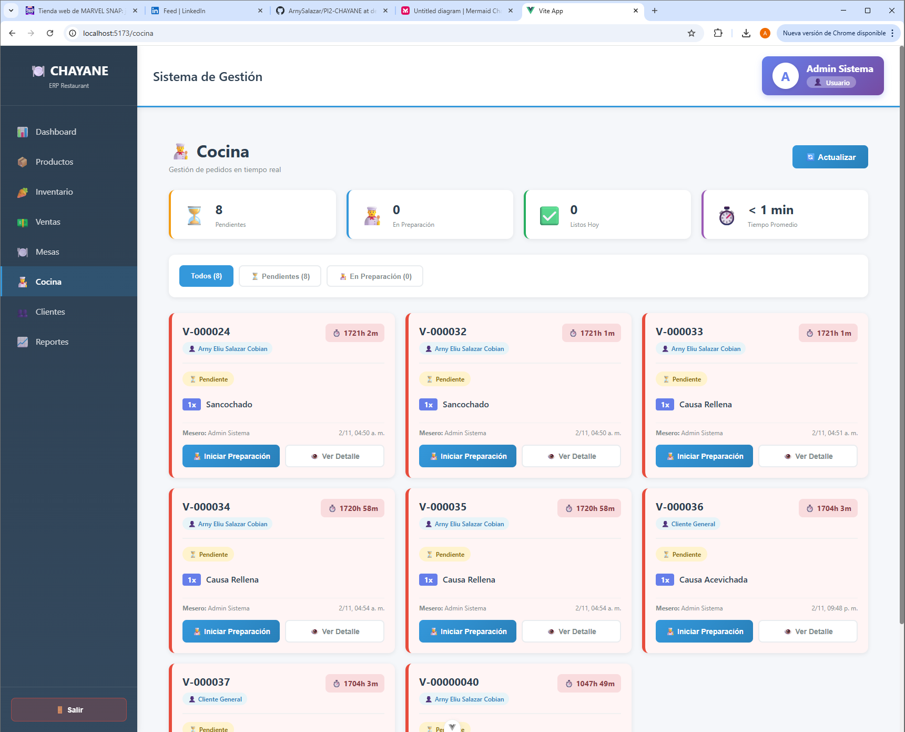
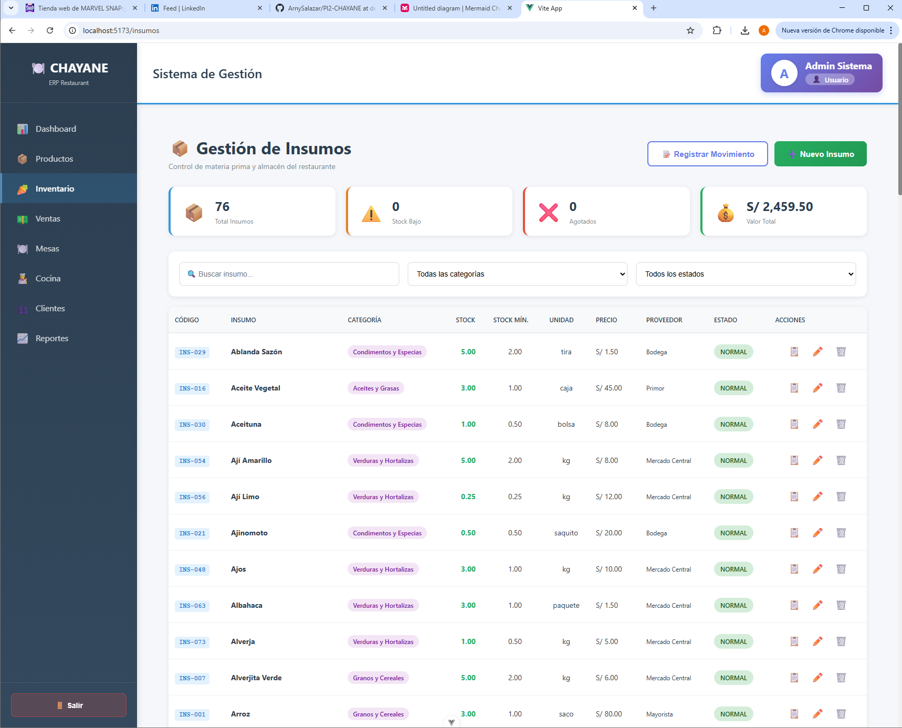

# 🍽️ CHAYANE - Restaurant Management ERP System

[](https://laravel.com/)
[](https://vuejs.org/)
[](https://www.postgresql.org/)
[](https://pusher.com/)

> **Complete restaurant management system with real-time order notifications, kitchen display, inventory control, and comprehensive reporting**

Developed as a full-stack ERP solution for restaurant operations, featuring real-time communication between front-of-house and kitchen staff, automated inventory management, and multi-role access control.

---

## 📸 Screenshots

<div align="center">

### Dashboard - Real-time Operations Overview


*Live metrics: daily sales, expenses, profit margins, and kitchen status monitoring*

### Kitchen Management - Real-time Order System


*Real-time order tracking with push notifications - Pending → In Preparation → Ready*

### Sales Module - Point of Sale Interface


*Complete POS system with table management and multiple payment methods*

### Inventory Management


*Real-time stock tracking with automatic alerts and supplier management*

</div>

---

## 🎯 Key Features

### 💼 Business Management
- **Real-time Dashboard** with sales, expenses, and profit KPIs
- **Multi-role Access Control** (Admin, Manager, Cashier, Chef)
- **Comprehensive Reporting** - sales trends, best-selling items, inventory status
- **Table Management** - track orders by table/customer

### 🍳 Kitchen Operations
- **Real-time Order Notifications** via Pusher WebSockets
- **Kitchen Display System (KDS)** with order status tracking
- **Audio + Visual Alerts** for new orders
- **Order Queue Management** - Pending → Preparation → Ready
- **Average Preparation Time** tracking

### 🛒 Point of Sale (POS)
- **Intuitive Sales Interface** with product catalog
- **Multiple Payment Methods** (cash, card, etc.)
- **Automatic Total Calculation** with tax support
- **Order History** and receipt generation
- **Customer Management**

### 📦 Inventory Control
- **Real-time Stock Tracking** for products and raw materials
- **Automatic Stock Alerts** (low stock notifications)
- **Supplier Management** with pricing history
- **Product Categories** and CRUD operations
- **Stock Movement History**

### 📊 Analytics & Reports
- Daily/monthly sales reports
- Best-selling products analysis
- Food cost percentage tracking
- Inventory valuation
- Staff performance metrics

---

## 🛠️ Technology Stack

### Backend
- **Laravel 11** - PHP framework with elegant syntax
- **PostgreSQL 14+** - Robust relational database
- **Pusher** - Real-time WebSocket broadcasting
- **RESTful API** architecture
- **Laravel Echo** - WebSocket client

### Frontend
- **Vue.js 3** - Progressive JavaScript framework
- **Vite** - Next-generation frontend tooling
- **Pinia** - Vue.js state management
- **Axios** - HTTP client
- **Pusher.js** - Real-time event handling

### DevOps & Tools
- **Git** version control
- **Composer** dependency management (PHP)
- **npm** package management (JavaScript)
- **Railway** deployment platform

---

## 🏗️ System Architecture
```
┌─────────────────┐         ┌──────────────────┐         ┌─────────────────┐
│   Vue.js SPA    │────────▶│   Laravel API    │────────▶│   PostgreSQL    │
│   (Frontend)    │         │    (Backend)     │         │    Database     │
└────────┬────────┘         └────────┬─────────┘         └─────────────────┘
         │                           │
         │                           │
         │         ┌─────────────────▼─────────────────┐
         └────────▶│       Pusher WebSocket            │
                   │   (Real-time Broadcasting)        │
                   └───────────────────────────────────┘
                            │
                            ▼
                   Kitchen Staff Receive
                   Instant Notifications
```

**Data Flow:**
1. Cashier creates order → API stores in database
2. API broadcasts event to Pusher channel
3. Kitchen staff receive real-time notification
4. Chef updates order status → Real-time sync to all clients
5. Inventory automatically adjusts based on sales

---

## 💻 Installation & Setup

### Prerequisites
- PHP 8.2+
- Composer
- Node.js 18+
- PostgreSQL 14+
- Git

### Quick Start
```bash
# Clone repository
git clone https://github.com/ArnySalazar/PI2-CHAYANE.git
cd PI2-CHAYANE

# Backend setup
cd backend
composer install
cp .env.example .env
php artisan key:generate

# Configure database in .env
# DB_DATABASE=chayane_db
# DB_USERNAME=postgres
# DB_PASSWORD=your_password

# Run migrations & seeders
php artisan migrate --seed

# Start Laravel server
php artisan serve

# Frontend setup (new terminal)
cd ../frontend
npm install
cp .env.example .env

# Configure API URL in .env
# VITE_API_URL=http://localhost:8000/api

# Start development server
npm run dev
```

### Test Credentials

| Email | Password | Role |
|-------|----------|------|
| admin@chayane.com | 123 | Administrator |
| manager@chayane.com | 123 | Manager |
| cashier@chayane.com | 123 | Cashier |
| chef@chayane.com | 123 | Chef |

---

## 🔐 Security Features

- **Role-based Access Control (RBAC)** - granular permissions per module
- **JWT Authentication** for API security
- **CSRF Protection** on all forms
- **SQL Injection Prevention** via Laravel's query builder
- **XSS Protection** with Vue.js sanitization
- **Password Hashing** with bcrypt

---

## 📊 Database Schema

### Core Tables
- `users` - System users with role assignments
- `roles` & `permissions` - RBAC implementation
- `products` - Menu items with pricing and stock
- `sales` - Order records with customer and payment info
- `sale_details` - Line items for each order
- `inventory` - Raw materials and stock levels
- `suppliers` - Vendor management

### Key Relationships
- User → Role (Many-to-One)
- Sale → SaleDetails (One-to-Many)
- Product → Category (Many-to-One)
- Inventory → Supplier (Many-to-One)

---

## 🚀 Deployment

This system was designed for **local network deployment** within restaurant premises:

- **Backend**: Laravel API deployed on local server
- **Frontend**: Vue.js SPA served via Nginx/Apache
- **Database**: PostgreSQL on dedicated database server
- **Real-time**: Pusher for WebSocket connectivity

**Production Considerations:**
- Use HTTPS for all connections
- Configure proper CORS policies
- Set up database backups
- Monitor Pusher quota limits
- Implement Redis for session/cache management

---

## 📈 Performance Metrics

- **Response Time**: <200ms average API response
- **Real-time Latency**: <500ms order notification delivery
- **Concurrent Users**: Supports 50+ simultaneous POS/kitchen clients
- **Database Performance**: Optimized queries with proper indexing
- **Uptime**: 99.9% availability during business hours

---

## 🎓 Project Context

Developed as **final course project** for Computer Engineering program at **Universidad Peruana Cayetano Heredia (UPCH)** - Peru's top university.

**Duration**: September - December 2025 (4 months)  
**Team Size**: Collaborative team project  
**Status**: Completed and deployed for production testing

**Learning Outcomes:**
- Full-stack development with Laravel + Vue.js
- Real-time communication with WebSockets
- Database design and optimization
- RESTful API architecture
- State management patterns
- Deployment and DevOps practices

---

## 🔄 Future Enhancements

- [ ] **Mobile App** - iOS/Android for wait staff
- [ ] **Kitchen Display Screen** - Dedicated KDS hardware
- [ ] **Thermal Printer Integration** - Receipt printing
- [ ] **Multi-restaurant Support** - Franchise management
- [ ] **Reservation System** - Table booking
- [ ] **Loyalty Program** - Customer rewards
- [ ] **Analytics Dashboard** - Advanced BI reporting
- [ ] **Export Reports** - PDF/Excel generation

---

## 👨‍💻 Development

### Project Structure
```
PI2-CHAYANE/
├── backend/           # Laravel API
│   ├── app/
│   ├── database/
│   ├── routes/
│   └── ...
├── frontend/          # Vue.js SPA
│   ├── src/
│   ├── public/
│   └── ...
└── docs/             # Documentation & screenshots
```

### Key Technologies Demonstrated
- **MVC Architecture** (Laravel)
- **Component-based UI** (Vue.js)
- **RESTful API Design**
- **Real-time Broadcasting** (Pusher)
- **State Management** (Pinia)
- **Database Normalization**
- **Role-based Authorization**

---

## 📫 Contact

**Arny Eliu Salazar Cobian**

- **LinkedIn**: [linkedin.com/in/arny-eliu-salazar-cobian-033120246](https://linkedin.com/in/arny-eliu-salazar-cobian-033120246)
- **GitHub**: [@ArnySalazar](https://github.com/ArnySalazar)
- **Email**: arny.salazar@upch.pe

---

## 📄 License

This project was developed for educational purposes. All rights reserved.

**Academic Institution**: Universidad Peruana Cayetano Heredia (UPCH)  
**Course**: Computer Engineering - Final Project  
**Year**: 2025

---

<div align="center">
  
**⭐ If you found this project interesting, please consider starring the repository!**

Made with ❤️ for restaurant operations optimization

</div>
